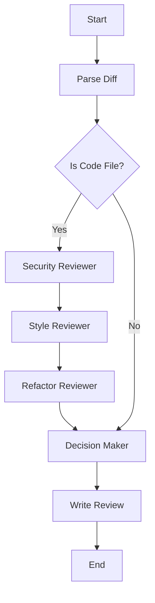

# 🚀 PR Intelligence Engine

[](https://python.org)
[](https://github.com/langchain-ai/langgraph)
[](https://groq.com)
[](https://fastapi.tiangolo.com)

**PR Intelligence Engine** is a high-performance, agentic Pull Request analysis system. Built with **LangGraph** and powered by **Groq**, it automates the code review process by orchestrating specialized AI agents to evaluate security, style, and maintainability.

---

## 🧠 Workflow Architecture

The system uses a stateful directed acyclic graph (DAG) to process code diffs intelligently.



---

## 🤖 The Agents

| Agent | Responsibility |
| :--- | :--- |
| **Diff Parser** | Breaks down raw GitHub diffs into structured JSON chunks. |
| **Security Expert** | Scans for hardcoded secrets, injection risks, and vulnerabilities. |
| **Style Enforcer** | Evaluates naming conventions, docstrings, and linting patterns. |
| **Architect** | Suggests refactors to improve maintainability and performance. |
| **Decision Maker** | Analyzes all findings to provide an automated 'Approve' or 'Reject' verdict. |

---

## 🛠️ Tech Stack

- **Core**: Python 3.10+
- **Agentic Logic**: LangGraph & LangChain
- **Inference**: Groq (Llama 3 70B)
- **API Layer**: FastAPI & Uvicorn
- **Concurrency**: Asyncio for non-blocking I/O

---

## 🚀 Getting Started

### 1. Installation
```bash
# Clone the repository
git clone https://github.com/salman1451/pr-intelligence-engine.git
cd pr-intelligence-engine

# Create virtual environment
python -m venv venv
source venv/bin/activate  # venv\Scripts\activate on Windows

# Install dependencies
pip install -r requirements.txt
```

### 2. Environment Setup
Create a `.env` file in the root directory:
```env
GROQ_API_KEY=your_groq_api_key
GROQ_MODEL=llama-3.3-70b-versatile
```

### 3. Run the API
```bash
uvicorn app.main:app --reload
```

---

## 📬 API Usage

**POST** `/api/v1/review`

**Payload:**
```json
{
  "pr": 1,
  "repo": "user/repo",
  "title": "Add new login logic",
  "desc": "Implements basic auth",
  "author": "salman1451",
  "raw_diff": "diff --git a/auth.py..."
}
```

---

<p align="center">
  Built with ❤️ by Salman Ahmed using LangGraph & Groq
</p>
